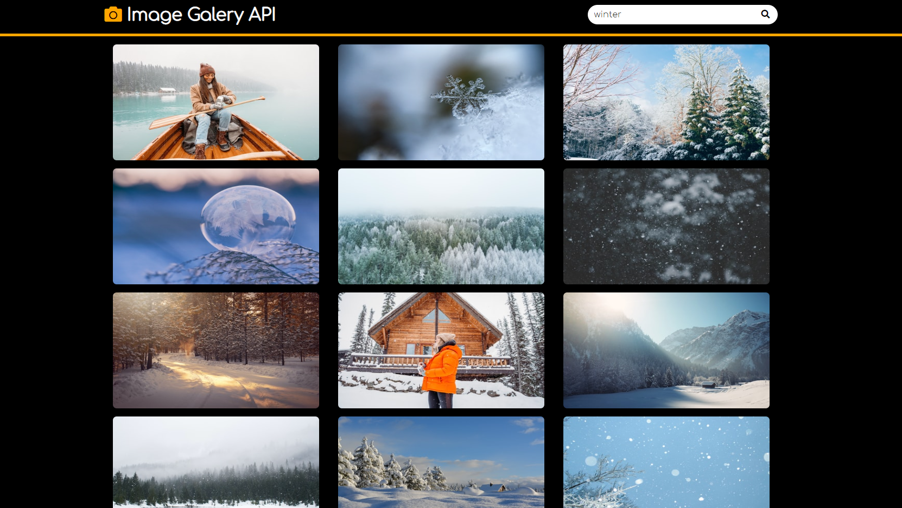

# image-galery

## Описание проекта

Image Galery - приложение отображающее полученные от API фото. При вводе поискового запроса изменяются фото, которые отображаются в приложении.

<kbd></kbd>

- Вёрстка состоит из трёх блоков: `<header>`, `<main>`
- Блок `<main>` состоит из одной секций `<section>`

[Деплой проекта](https://zixail28.github.io/image-galery/)
